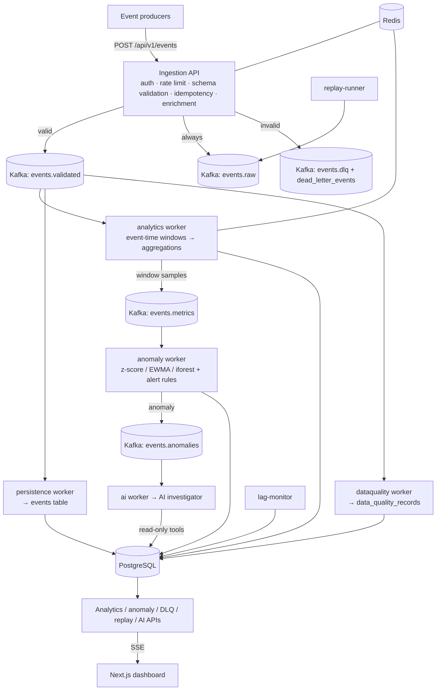

# Pravāha — Real-Time Data Streaming & Event Intelligence Platform

> **Pravāha** (प्रवाह) — "flow" / "stream".

Pravāha is a production-style, end-to-end **event streaming and intelligence platform**. It
ingests high-volume events, validates them against a schema registry, publishes them to
**Apache Kafka**, processes them with a reusable **event-time stream-processing** layer
(windowing, watermarks, late-event handling, stateful aggregation), computes real-time
business analytics, detects anomalies with multiple statistical strategies, and runs an
**evidence-grounded AI investigator** that explains anomalies using only data it retrieves
through read-only tools. A **Next.js** dashboard renders all of it live over SSE.

The demo workload is an **e-commerce** platform (`order.*`, `payment.*`, `inventory.*`,
`shipment.*`, `user.*`, `product.*`).

---

## 1. What Pravāha is

A focused, technically deep implementation of the concepts behind systems like Kafka +
Flink + a real-time analytics/observability pipeline — **not** a clone of any of them. It is
built to be discussed in an interview: every dashboard number comes from processed events,
every AI conclusion cites real evidence, and every delivery guarantee is documented
accurately.

## 2. Why it exists

A portfolio project that demonstrates, with working code:

distributed systems · event-driven architecture · Kafka partitioning / consumer groups /
offsets · at-least-once delivery + application idempotency · event-time processing ·
watermarks · tumbling / sliding / session windows · late & out-of-order events · stateful
stream processing · backpressure · DLQ + retry with backoff/jitter · replay · schema
registry + evolution · data-quality scoring · anomaly detection (rolling z-score, EWMA,
Isolation Forest) · dynamic baselines · alerting with cooldowns · consumer-lag monitoring ·
AI tool-use with evidence grounding and hallucination guards · RBAC · audit logging ·
Prometheus metrics + structured logs · Docker Compose · CI.

## 3. Architecture



More diagrams: [`docs/architecture/`](docs/architecture/). Decisions:
[`docs/decisions/`](docs/decisions/).

## 4. Technologies

| Layer | Choice |
| --- | --- |
| Ingestion / API | Python 3.11, FastAPI, Pydantic v2 |
| Stream processing | Python `asyncio`, `aiokafka` consumers, reusable primitives in `pravaha.processing` |
| Broker | Apache Kafka (KRaft, single broker for local) |
| Store | PostgreSQL 16, SQLAlchemy 2 (async), Alembic |
| Cache / state / coordination | Redis 7 |
| Data science | NumPy, pandas, scikit-learn |
| AI | OpenAI-compatible + Groq-compatible + deterministic mock (`pravaha.ai.provider`) |
| Frontend | Next.js 14 (App Router), TypeScript, Tailwind, Recharts, SSE |
| Infra | Docker + Docker Compose, GitHub Actions |

One installable Python package (`pravaha`) backs the API **and** every worker; Compose runs
the same image with different `command:` — see
[`docs/decisions/0002-consolidated-python-package.md`](docs/decisions/0002-consolidated-python-package.md).

## 5. Local setup

Prereqs: Docker + Docker Compose, ~4 GB free RAM.

```bash
cp .env.example .env
docker compose up -d --build            # postgres, redis, kafka, api, all workers, web
docker compose run --rm migrate         # alembic upgrade head (also runs automatically for api)
# generate demo traffic (creates a demo producer + schemas, prints real counts):
docker compose --profile demo up seed
# or from the host:
python -m pravaha.scripts.generate_events --bootstrap --rate 60 --duration 300
```

Open:

- Dashboard: <http://localhost:3000> (login `admin@pravaha.local` / `admin12345`)
- API docs: <http://localhost:8000/docs>
- Metrics: <http://localhost:8000/metrics>

Dev without Docker for the app tier (infra still in Docker):

```bash
python -m venv .venv && . .venv/Scripts/activate      # or bin/activate
pip install -e ".[dev]"
alembic upgrade head
uvicorn pravaha.api:app --reload
python -m pravaha.workers analytics --health-port 9101
python -m pravaha.workers persistence --health-port 9102
# ... anomaly, ai, dataquality, audit, lag-monitor, replay-runner, retention
cd apps/web && npm install && npm run dev
```

### Run it in the cloud (free)

The whole stack (~4 GB RAM, real Kafka) doesn't fit "free web service" tiers, but
there are three free ways to run it — full walkthrough in
[`docs/operations/deploy-free.md`](docs/operations/deploy-free.md):

- **GitHub Codespaces** — no card, the whole platform in ~5 min. Open
  **Code ▸ Codespaces ▸ Create**, then `docker compose up -d --build && docker compose run --rm migrate`.
  The repo ships a `.devcontainer/`. Stops when idle; 60 free core‑hours/month.
- **Oracle Cloud Always Free (Ampere A1, 24 GB RAM, forever)** — a public 24/7 URL.
  `cp deploy/.env.prod.example .env`, edit, `sudo bash deploy/deploy.sh`. Uses the
  prebuilt GHCR images + Caddy auto‑HTTPS (`docker-compose.prod.yml`). Card is used
  for identity verification only.
- **Vercel** — the Next.js dashboard only (free); pair it with a backend from one of
  the above.

`.github/workflows/images.yml` publishes `ghcr.io/<owner>/pravaha-{app,web}` on every
push to `main`.

## 6. Environment variables

All configuration is environment-driven; see [`.env.example`](.env.example) for the full
list with safe local defaults. Nothing secret is committed; `.env` is git-ignored. Key
groups: `POSTGRES_*`, `REDIS_*`, `KAFKA_*`, `API_JWT_SECRET`, `WATERMARK_*`,
`CONSUMER_*`, `INGEST_*`, `AI_*`, `EVENT_RETENTION_DAYS`.

## 7. Kafka topics

Defined in [`pravaha/kafka/topics.py`](pravaha/kafka/topics.py); created idempotently on
API start and by `python -m pravaha.scripts.ensure_topics`.

| Topic | Partitions | Purpose |
| --- | --- | --- |
| `events.raw` | 6 | Everything ingestion accepted, pre-validation. Replay/audit source of truth. |
| `events.validated` | 6 | Envelope + schema-valid events. Main topic for all business consumer groups. |
| `events.metrics` | 3 | Windowed metric samples from the analytics worker → anomaly worker + dashboard. |
| `events.anomalies` | 3 | Anomaly records → AI worker + realtime fan-out. |
| `events.dlq` | 3 | Dead-letter events + failure metadata (mirrored to `dead_letter_events`). |
| `events.replay` | 6 | Replay target; replayed events carry `is_replay=true`. |
| `events.audit` | 3 | Platform audit events → audit worker → `audit_logs`. |

## 8. Event model

Canonical envelope ([`pravaha/events/envelope.py`](pravaha/events/envelope.py)):
`event_id`, `event_type` (dot-namespaced), `event_version`, `producer`/`producer_id`,
`schema_id`/`schema_version_id`, **`event_time`** (producer), **`ingestion_time`**
(platform), `partition_key`, `correlation_id`, `trace_id`, `region`, `payload`,
`metadata`, plus `lateness_at_ingest`, `is_replay`, `replay_job_id`. Processing time is
assigned by processors, not carried on the wire.

## 9. Stream processing

Reusable primitives in [`pravaha/processing`](pravaha/processing): `Filter`, `Transform`,
and incremental `Aggregator`s (`count`, `sum`, `avg`, `rate`, `distinct_count`, `topn`)
with `update`/`merge`/`finalize`. Pipelines are `Source → Filter → Transform → Group →
Window → Aggregate → Sink`; a config-driven pipeline graph is validated by
`pravaha.processing.pipeline_spec` (DAG, single source, ≥1 sink, stage ordering) before it
can be published (published versions are immutable).

## 10. Windowing

`TumblingWindower`, `SlidingWindower`, `SessionWindower` — all epoch-aligned so any
processor instance computes identical window identities. The analytics worker uses
1-minute tumbling windows keyed on **event time**.

## 11. Event-time processing

Three clocks are distinct: `event_time`, `ingestion_time`, `processing_time`. Windows are
assigned by `event_time`. Allowed lateness is configurable
(`WATERMARK_ALLOWED_LATENESS_SECONDS`, default 30s).

## 12. Watermarks & late events

`pravaha.processing.watermark.Watermark` = `max(event_time_seen) − allowed_lateness`, with
bounded wall-clock advance when a partition goes idle. A window is finalised once the
watermark passes `window_end` (+ grace). Events are classified `on_time` /
`accepted_late` / `too_late` and late counts are tracked per window and as
`pravaha_late_events_total`. **Honest limitation:** the watermark is *per consumer process*;
there is no cross-process watermark coordination — see
[`docs/decisions/0005-event-time.md`](docs/decisions/0005-event-time.md).

## 13. Consumer groups

Independent groups, independent offsets, so a slow stage never back-pressures another:
`pravaha.analytics`, `pravaha.persistence`, `pravaha.dataquality`, `pravaha.anomaly`,
`pravaha.anomaly_ai`, `pravaha.audit`. **Ordering** is guaranteed only *within a Kafka
partition*; the `partition_key` (correlation/order/user id) keeps one business transaction
on one partition. Pravāha never claims global ordering.

## 14. Idempotency

Delivery is **at-least-once**. Every processor is idempotent via a unique
`(event_id, processor)` row in `event_processing_records`, checked before side effects and
written after. Ingestion additionally de-dupes on `(producer_id, event_id)` in Redis
(fails open if Redis is down). Duplicate events are counted, not reprocessed. See
[`docs/decisions/0006-at-least-once.md`](docs/decisions/0006-at-least-once.md),
[`0007-idempotency.md`](docs/decisions/0007-idempotency.md).

## 15. DLQ

Failures (validation, retries exhausted, malformed wire payloads) go to `events.dlq` **and**
`dead_letter_events` with reason, processor, attempt count and error detail. From the UI /
API you can **inspect**, **retry** (republishes to `events.raw`; idempotency prevents
duplicate effects) or **discard** (confirmation required). Retry strategy: exponential
backoff + jitter, `CONSUMER_RETRY_MAX_ATTEMPTS`, then DLQ. Permanent (validation) errors
are never retried.

## 16. Replay

`replay_jobs` + a dedicated `replay-runner` worker. Select a time range + optional
event-type / producer filters; events are re-read from the store and republished to
`events.replay` with `is_replay=true` + `replay_job_id`. Progress and counts are written
back to the job row; runs are auditable.

## 17. Anomaly detection

`pravaha.anomaly`: **rolling z-score** (throughput-style metrics), **EWMA** (rate-style
metrics), **Isolation Forest** (multivariate). `choose_detector` picks per metric. Dynamic
baseline: same-minute-of-hour average over the last 7 days when ≥ 5 samples exist, blended
with the rolling estimate; falls back to rolling only otherwise. Anomalies are de-duplicated
(`dedup_key`), persisted, and emitted to `events.anomalies`. Severity from |z|:
LOW/MEDIUM/HIGH/CRITICAL.

## 18. AI intelligence

`pravaha.ai`: an investigation state machine (`CREATED → RUNNING → COMPLETED / FAILED /
CANCELLED`) that gives the model **only** an anomaly plus a set of **read-only, allow-listed
tools** (`get_anomaly_context`, `query_metrics`, `get_correlated_events`, `get_event`,
`get_consumer_lag`, `get_data_quality`, `get_producer_health`, `get_recent_alerts`,
`get_anomaly_history`). Every tool call is logged (`ai_tool_calls`); every provider call's
tokens/cost/latency is recorded (`ai_usage`). The final JSON conclusion is validated and
its `evidence_refs` are **cross-checked against ids that tools actually returned** —
hallucinated refs are dropped and flagged, and confidence is downgraded when nothing is
grounded. Multiple hypotheses (H1–H5) are scored; the system does not force a single
conclusion when evidence is weak. Providers: OpenAI-compatible → Groq-compatible →
deterministic **mock** (offline, used for the demo and for deterministic evaluation). **If
AI is unavailable, streaming is unaffected** and the investigation is marked `FAILED` with a
reason.

## 19. Security

JWT auth; RBAC (`VIEWER < ANALYST < ENGINEER < ADMIN`) enforced server-side; producer API
keys are HMAC-SHA256 hashed (plaintext shown once); request body-size + Redis-backed rate
limits; parameterised queries via the ORM; secure headers + configurable CORS; secrets only
via env. AI: tool allow-listing, evidence boundary, versioned prompts, output validation,
full tool-call audit. See [`docs/operations/security.md`](docs/operations/security.md).

## 20. Testing

- **Unit** (`tests/unit`, no infra): envelope/validation, windows, watermark & lateness,
  aggregators, anomaly detectors, DQ scoring, schema compatibility, pipeline spec,
  security/partitioning, AI mock reasoning + hallucination filtering. — `pytest tests/unit`
- **Failure** (`tests/failure`): Redis-down fail-open, AI-failure isolation contracts.
- **Integration** (`tests/integration`, testcontainers, auto-skips without Docker):
  ingest→Kafka→analytics→aggregations, idempotency, schema→DLQ, API auth/RBAC/CRUD, and the
  full AI investigation flow with the mock provider.
- **E2E** (`tests/e2e`, Playwright): login → producer → schema → generate → live stream →
  metrics → trigger anomaly → AI investigation → DLQ → replay.

```bash
pytest tests/unit tests/failure -q          # fast, no Docker
pytest -m integration -q                     # needs Docker
cd apps/web && npx playwright test           # needs the full stack running
```

## 21. Load testing

`python -m pravaha.scripts.load_test --sweep 100,500,1000 --duration 30 --bootstrap --out load-test-results/run.json`
reports **measured** throughput and p50/p95/p99 latency. Numbers are never fabricated — if
the local box can't sustain a target, the achieved rate shows it and that is what gets
recorded. See [`docs/operations/load-testing.md`](docs/operations/load-testing.md).

## 22. Failure recovery

Consumers commit offsets only after a batch is fully handled → crash-safe resume.
Backpressure: bounded in-flight set, partitions paused when full (`pravaha_consumer_paused`)
and resumed on drain. Redis / AI outages degrade gracefully. Postgres outage: processing
retries; offsets are not advanced past unpersisted work. Scenario simulator
(`pravaha.scripts.scenarios`) reproduces payment-failure spike, traffic surge, consumer
lag, data-quality degradation, late-event storm, and multi-signal anomaly.

## 23. Design tradeoffs & known limitations

See [`docs/decisions/`](docs/decisions/) for the full ADRs. Headlines:

- **Per-process watermark**, no distributed watermark coordination.
- **At-least-once** end to end; exactly-once *effects* only where application idempotency
  enforces it (documented per consumer).
- **PostgreSQL as the event store** for the portfolio scope; `pravaha.retention` shows the
  archive-then-delete seam where object storage / a data lake would attach.
- The **five Python "apps"** share one package with separate worker entrypoints.
- Local Kafka is a **single broker, RF=1** — not HA.
- AI cost figures use a small static price table; treat as estimates.
- Load numbers depend entirely on the host; this repo ships the harness, not a benchmark
  claim.

## 24. Batch layer (Spark / Scala)

Pravaha's speed layer is real-time and Kafka-driven (`pravaha.analytics.processor`):
fast, but an *approximation* — it classifies event-time lateness against a heuristic
watermark and flushes a window after a bounded grace period, whether or not every
late-arriving row has shown up yet. Pairing that with an offline **batch layer** that
periodically re-derives the same kind of numbers from the immutable event log is a
standard architecture (Lambda architecture: a fast/approximate speed layer plus a
slower/exact batch layer, reconciled in a serving layer) — genuinely useful here, not
decoration, because it gives you a number you can trust after the fact with none of the
speed layer's time pressure.

**What it computes.** `spark/` is a real Scala (2.13) + Spark (4.1.3) job,
`pravaha.batch.EventRollupJob`, that reads a time window from the `events` table
(Pravaha's actual durable store — same table `pravaha.analytics.persistence` writes,
see [`docs/decisions/0009-event-storage.md`](docs/decisions/0009-event-storage.md)) and
computes an **hourly rollup per (event_type, region)**:
`event_count`, `distinct_correlation_ids`, `distinct_users`, `total_amount` /
`avg_amount` (revenue, from the same `amount` column the speed layer uses),
`late_event_count` (an exact recount of the speed layer's lateness classification —
useful for auditing how aggressive the watermark is), and `replay_event_count`. Results
land in `batch_event_rollups` (owned by the `BatchEventRollup` SQLAlchemy model +
its Alembic migration), which Pravaha's own FastAPI backend then serves.

**Run it** (no Spark install, no cluster — `sbt run` launches an embedded `local[*]`
`SparkSession` in a forked JVM; needs JDK 17+ and `sbt` on PATH):

```bash
alembic upgrade head          # creates batch_event_rollups, from the repo root
cd spark
sbt "run --hours 24"                                            # last 24h, now-anchored
sbt "run --from 2026-09-08T00:00:00Z --to 2026-09-18T00:00:00Z" # explicit window
sbt test                                                          # aggregation-logic unit tests
```

Idempotent: rerunning a window deletes any rollup rows whose `hour_bucket` falls inside
it, then inserts fresh ones — safe to replay a window any number of times, the same way
Pravaha's own replay engine is safe to rerun.

**View it**: dashboard → **Batch Analytics** (`/batch`), backed by
`GET /api/v1/batch/rollups` and `/rollups/summary` (`pravaha/api/routers/batch.py`,
same auth/RBAC/pagination as every other Pravaha endpoint — this genuinely lives
alongside the existing backend, not a parallel service).

**Verified against real data, by hand, not just "it ran".** Against the actual
59,203-row `events` table generated by real Pravaha traffic (normal load +
the `payment_failure_spike` scenario), the job produced 288 rollup rows; a dozen of
them (`payment.completed` and `payment.failed`, all 6 regions, for the 09:00 UTC hour)
were independently recomputed with hand-written SQL against the raw `events` table and
matched the Spark output exactly — same `event_count`, `distinct_correlation_ids`,
`distinct_users`, `total_amount` and `avg_amount` to the last decimal. A rerun of the
same window was confirmed to replace, not duplicate (288 rows before, 288 after).

Two real bugs surfaced during that verification and are fixed in the job (see the
comments at the fix sites):
1. SQLAlchemy's `Enum(LatenessClass, native_enum=False)` persists the Python enum's
   **member name** (`'ON_TIME'`), not its `.value` (`'on_time'`) — confirmed against the
   live column, not assumed. The job's late-event SQL compares against the stored form.
2. Spark's JDBC read/write path converts timestamps through **the session's local
   timezone**, not a fixed instant, unless `spark.sql.session.timeZone` is pinned to
   `UTC` — on this (IST) dev machine, `hour_bucket` silently landed 5.5 hours off until
   that config was set explicitly. Fixed by setting it (and `-Duser.timezone=UTC` on the
   forked JVM) in `EventRollupJob`.

### 24.1 Second batch job: cross-event-type correlation summary

`EventCorrelationJob` (`spark/src/main/scala/pravaha/batch/EventCorrelationJob.scala`) is a
second, deliberately *different* aggregation over the same real `events` table, not another
re-slice of event counts. For every unordered pair of event types it computes the **Pearson
correlation coefficient and sample covariance** of their per-minute (configurable via
`--bucket-minutes`) event counts across the whole requested window — e.g. does
`payment.failed` volume move with `order.cancelled` volume; does `product.viewed` move with
`product.purchased`. Results go to `batch_event_correlations` (`BatchEventCorrelation`
model + its own Alembic migration).

**Why this is a real batch-only capability, not busywork:** the real-time speed layer
(`pravaha.analytics.processor`) maintains one bounded 1-minute tumbling window per metric
and discards it once flushed — it can tell you this minute's count, but computing "how
strongly do these two event types correlate across every minute we've ever recorded" needs
random access to the entire history at once, which a stateful streaming operator
structurally can't hold and a single batch pass over the durable table can do trivially.

Run it (same connection env vars, same `sbt` prerequisite as the rollup job):
```bash
cd spark
sbt "runMain pravaha.batch.EventCorrelationJob"                 # all history, 1-minute buckets
sbt "runMain pravaha.batch.EventCorrelationJob --bucket-minutes 5"
```

**Verified against the same real data** (49,203 events currently in `events` — the table's
row count has since dropped from the 59,203 cited above as `pravaha.retention` aged out
older rows, which is itself the retention worker doing its real job, not a discrepancy):
16 distinct event types → 120 pairs computed over 25 real 1-minute buckets. Three pairs
were independently recomputed with pandas/numpy directly against the raw `events` table and
matched Spark's output to 14+ significant figures — `order.created`↔`payment.initiated`
r≈0.999 (they fire together almost every transaction), `inventory.released`↔`payment.failed`
r≈0.995 (inventory is released exactly when a payment fails), `order.cancelled`↔`payment.failed`
r≈0.953 (weaker — cancellations also happen for unrelated reasons), matching the domain
logic those event types actually have in the generator. A rerun was confirmed to replace,
not duplicate, its 120 rows.

Two more real bugs surfaced during that verification and are fixed in the job:
3. Spark 4's default ANSI SQL mode makes `corr()`/`covar_samp()` **throw** on a zero-variance
   input (e.g. an event type with the exact same count in every bucket) instead of returning
   `NULL` — caught by the unit test, not assumed; fixed with
   `spark.sql.ansi.enabled=false`, since "correlation is undefined" is a real, valid answer
   here, not a job failure.
4. Bucketing event timestamps via `floor(extract(epoch FROM event_time) / n)` uses
   Postgres's `double precision` epoch value, which can't exactly represent every
   microsecond-precision timestamp at 2026-scale magnitudes — a handful of events sitting
   right on a bucket boundary could round into the wrong minute. Cross-checking this job's
   output against an independent pandas recomputation caught a real, small (~0.004) drift in
   one pair's correlation; fixed by bucketing with pure `bigint` integer division instead,
   which cannot misround.

## Repository layout

```
pravaha/            core package: config, db, kafka, events, processing, analytics,
                    anomaly, alerting, dlq, replay, dataquality, ai, api, workers, scripts
apps/web/           Next.js dashboard
spark/              Scala/Spark batch layer (hourly event rollups) - see §24 above
alembic/            migrations (0001 bootstraps from model metadata; later = autogenerate)
infrastructure/     Dockerfiles, kafka helpers
scripts/            thin CLI wrappers around pravaha.scripts.*
tests/              unit · integration · failure · e2e · load
docs/               architecture · decisions (ADRs) · operations · api
docker-compose.yml  full local stack
```

## Verification status

The full stack has been run end to end on Docker Compose (`apache/kafka:3.9.0` KRaft,
`postgres:16`, `redis:7`, API + 10 workers + Next.js): 49k+ events ingested → Kafka →
persisted + windowed (event-time) aggregations with late-event accounting → consumer lag
held at 0 → a payment-failure scenario produced 4 anomalies (EWMA `CRITICAL` +
rolling-z-score `MEDIUM`) → AI investigations completed with grounded evidence, hypotheses
and recommendations → replay job replayed 168/168 events → DLQ inspect/retry/discard,
data-quality scoring, correlation chains and the dashboard all verified. 58
unit/failure tests pass; frontend lint + typecheck + build pass. Measured load numbers and
known limitations are in [`docs/operations/load-testing.md`](docs/operations/load-testing.md).
The Scala/Spark batch layer (§24) — both the hourly rollup and the cross-event-type
correlation job (§24.1) — has additionally been run against that same real event log, its
output cross-checked by hand against the raw table for each job, and all 3 Scala unit
tests pass — see §24/§24.1 for the exact numbers and the four real bugs that
verification caught.

## Git / attribution

Authored by **Harsh Raj** (GitHub [`HxrshRaj`](https://github.com/HxrshRaj)) —
<https://github.com/HxrshRaj/Pravaha>.
