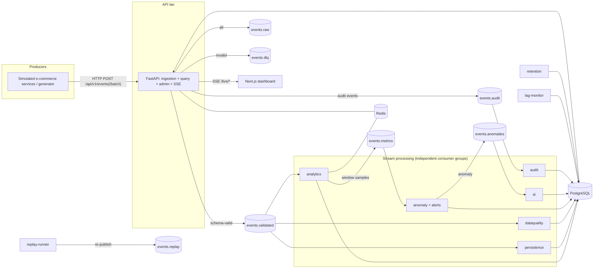
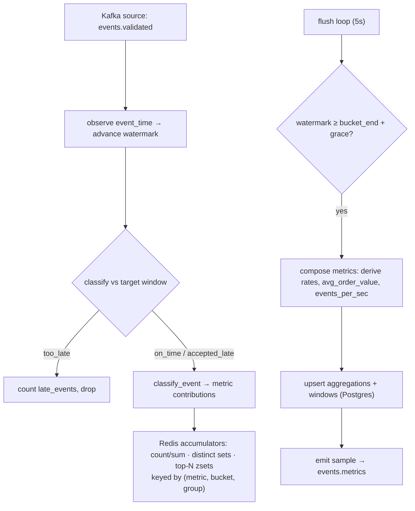
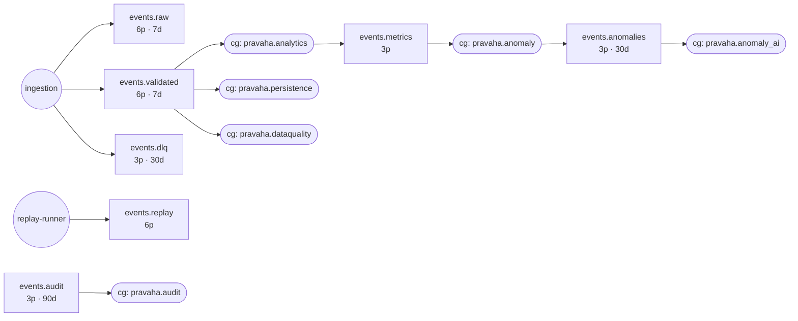
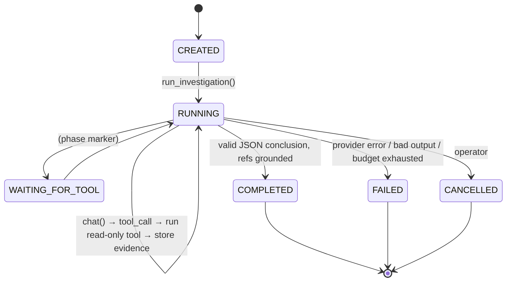
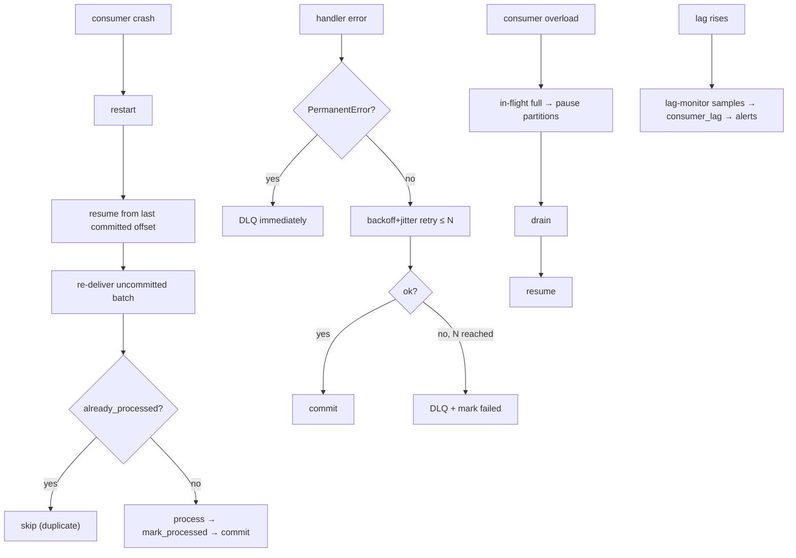
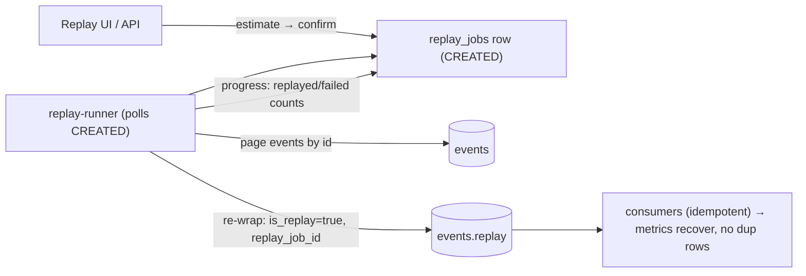

# Pravāha architecture

## System architecture

## Streaming pipeline (analytics worker internals)

## Kafka topic topology

Ordering: **per-partition only.** `partition_key = correlation_id | order_id | user_id |
producer key`, so one business transaction stays on one partition and is processed in order.
There is no global ordering.

## Consumer group architecture

| Group | Topic(s) | Job | Idempotency key |
| --- | --- | --- | --- |
| `pravaha.analytics` | `events.validated` | event-time windowed aggregation → `aggregations`, `windows`, `events.metrics` | `(event_id, "analytics")` |
| `pravaha.persistence` | `events.validated` | write `events` (searchable store) | `INSERT ON CONFLICT (event_id)` |
| `pravaha.dataquality` | `events.validated`, `events.raw` | per-producer DQ scoring → `data_quality_records` | `(event_id, "dataquality")` |
| `pravaha.anomaly` | `events.metrics` | detectors + alert rules → `anomalies`, `alerts`, `events.anomalies` | `dedup_key` on anomaly |
| `pravaha.anomaly_ai` | `events.anomalies` | create + run AI investigation | investigation per anomaly |
| `pravaha.audit` | `events.audit` | append `audit_logs` | append-only |

## AI investigation flow

Evidence pipeline: `ANOMALY_DETECTED → INVESTIGATION_CREATED → EVIDENCE_COLLECTION
(query_metrics, get_correlated_events, get_consumer_lag, get_data_quality, get_recent_alerts,
get_anomaly_history) → HYPOTHESIS_GENERATION (H1–H5 scored) → HYPOTHESIS_TESTING →
CONCLUSION → RECOMMENDATIONS`. Final `evidence_refs` are intersected with ids tools actually
returned.

## Failure / recovery flow

## Replay architecture

